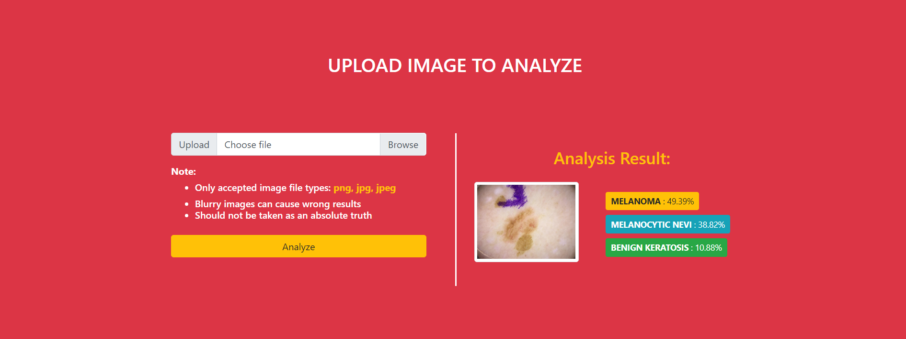

# Skinclassinator
Skin is commonly identified as the largest organ in the body and many suffer from skin disease. These associated diseases can affect not only the skin that can lead to further risk of skin cancer but also can cause lack of self-confidence and psychological depression.  

The system is focused on detection and classification of skin diseases with the use of deep learning algorithm namely MobileNet Convolutional Neural Network (CNN). The training dataset gathered were from dermoscopic image data in the study from MNSIT HAM10000 dataset published by International Skin Image Collaboration (ISIC). 

The dataset is divided into seven classes of skin diseases which fall into the category of skin cancer. The system includes this skin diseases: 
- Melanoma
- Melanocytic Nevi
- Benign Keratosis 
- Basal Cell Carcinoma 
- Actinic Keratosis
- vascular Skin Lesions
- Dermatofibroma

## Objectives
The aim of the project is to quickly identify the top three highest probability diagnoses on the given image skin disease image of the user. It will also be a great help for giving knowledge to both patient and the doctor. By using this system, initial findings of the skin disease can be efficiently and effectively diagnosed by the general practitioners thus possibly reducing further complication of the arising skin disease.

## Motivation
Melanoma is less common than some other types of skin cancers. But melanoma is more dangerous because it's much more likely to spread to other parts of the body if not caught and treated early. It is the third most common skin cancer in the Philippines. As stated by ManilaMed, approx. 1 out of 50 men and women who will be diagnosed with Melanoma during their lifetime.

According to the latest WHO data published in 2020 Skin Cancers Deaths in Philippines reached 368 or 0.05% of total deaths. The age adjusted Death Rate is 0.52 per 100,000 of population ranks Philippines #161 in the world.

## Demo
https://user-images.githubusercontent.com/27999234/182180901-7068cc1e-85c0-46b0-b568-f7616a58a4e0.mp4

